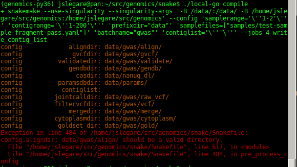

Manuscript Notes
=================

The scripts contained in this folder are part of a generic framework
built for the purpose of calling variants in our compute-canada
compute environment. There are several scripts and binaries involved,
all orchestrated through Snakemake. The framework and its scripts are
still in development in a separate repository
(`github.com/rieseberglab/snp-calling`). What is included in this
repository is a snapshot of the repository used to process the data
published in the manuscript.

The Snakefile (i.e. `snake/Snakefile`) constitutes a record of the
commands invoked to process our samples. There is also a configuration
file `snake/config.yaml` which contains some of the default settings
we have used in our experiments. Some of the configuration parameters,
namely controlling the size of jobs can be provided on the command line
to one of the two launching scripts (local-go, and compute-canada-go) which
are described below. Example commands are provided in [pipeline.md](./pipeline.md).

The sample listings (e.g. urls, large downloaded files) and reference
assemblies are not provided as part of this repository, but can be
downloaded separately.

Some steps in this snakefile invoke custom binaries written in
Go. Those binaries are compiled from the source code under
`src/genomics`, and invoked from a singularity container defined in
the Snakefile. This singularity container is available publicly from
dockerhub and contains specific versions of necessary genomics tools.

Of those binary tools, `src/genomics/align` is a wrapper binary that
performs trimming, mapping (with ngm), and marking of
duplicates. Also, `src/genomics/vc` is a wrapper around gatk's
`HaplotypeCaller`, and allows parallelizing the operation over a
configurable number of threads. The other steps from the pipeline
invoke external tools directly in the Snakefile, or via scripts in
`snake/scripts/`.

The following documentation is a general description/manual to use the
framework.

Reproducible Variant Calling
====================

This repository contains a data-processing workflow and a set of
associated tools for performing variant calling across a large set of
genomes. It has been designed with careful consideration for
experimental reproducibility, computational efficacy, and
compute-environment portability.

Here are some of the features of the provided pipeline:

  - Scalable to GB and TB -size datasets
  - Follows Broad Institute's GATK4 best practices.
  - Works on a local server, or in cluster-scheduling environments (e.g. Compute-Canada).
  - Tracking of all inputs, software versions, and parameters.
  - Complete setup and installation of _all_ software dependencies.
  - Execution environment in versioned containers (docker/singularity).
  - Modular extensibility of rules and scripts in data-workflow definition language (Snakemake).
  - Ease of configuration of _all_ input parameters.
  - Safe parallel execution of jobs. This includes not leaving partial outputs from failed jobs.
  - Downloading of sample data, Alignment, Filtering, Genotyping, Variant Calling.
    * Support for HTTP, NanuQ, S3, Azure, and local filesystem files.
    * Caching of downloaded content. Avoids repeated large data transfers.
    * Automatic verification of data checksums, if available.
  - Validation of input and configuration parameters.

Provided Tools
---------------

The pipeline includes source code in-house tools, written in Go, to automate some of the scatter-gather
operations to multiple external computational biology tools.

The Go tools are in the src/genomics directory. See [Go Tools](./go_tools.md) for details on how to build.

Getting Started
--------------

Download the repository in any directory by using the following command:
```bash
    git clone git@github.com:rieseberglab/snp-calling.git
```

There are a few steps to get started. You would perform these steps only once. You can perform them from your own laptop, server, or from a login node on compute-canada (e.g. cedar):

```bash
(
    set -e

    REPODIR=~/snp-calling

    # install conda environment manager, miniconda. this will allow you to create new
    # conda environments.
    curl "https://repo.continuum.io/miniconda/Miniconda2-latest-Linux-x86_64.sh" > /tmp/conda.sh
    bash /tmp/conda.sh -b
    rm /tmp/conda.sh

    # Add the installed conda manager to your PATH
    export PATH=~/miniconda2/bin/:"$PATH"

    # Create a new environment for the pipeline.
    # it needs python=3.6.4.
    # it will download and install packages under ~/miniconda2/
    conda env create -f "$REPODIR/snake/environment.yaml" -n genomics-py36
)
```

_Note: The name of the conda environment here, `genomics-py36`, is arbitrary. For consistency, we will refer to it as such throughout this document._


Software Dependencies
--------------

That's it! (mostly). If you've setup the conda environment using the steps above, extra software will be automatically downloaded when you start running the pipeline.

There are what we would call "platform dependencies" that you will also need, outside what conda does for you. The pipeline assumes that the following is available:

  - A UNIX environment with core utilities (sh, bash, zip, cat, head, sed, etc.). This is required to invoke basic commands. Debian/Ubuntu flavours, Suse work well. MacOS should have everything too.

  - singularity version >= 2.5. this will generally require root/admin
    access to install. It lets you run self-contained program
    distributions that would otherwise require admin rights and
    complex steps to install. The pipeline makes extensive use of this to run particular
    deployments of java+GATK. Singularity is similar to another
    (perhaps more widely-known) tool, `docker`, but is generally safer to use in
    shared hosting scenarios, so it is often available where docker
    isn't. If you're familiar with docker and UNIX, you can think of
    singularity as a setuid-based set of scripts (no daemon) that will
    only allow you to run things as your own user and bind-mount
    filesystems you have access to.

How to Use
-------------

The data workflow is defined in `snake/Snakefile`. This is the core file that lists all the rules and scripts to process SNPs.

Whenever you start a work session (a new terminal), you will need to
activate the conda environment for the pipeline. This is because the
control file depends on tools being installed and avaible through your
environment. When you do so, your prompt will be updated with the name
of the environment (i.e. `genomics-py36`).

```bash
    user@host:~/snp-calling$ source ~/miniconda2/bin/activate genomics-py36
    (genomics-py36) user@host:~/snp-calling$
    # run some pipeline commands
```

Every pipeline command ultimately launches a `snakemake command` with
different parameters. Snakemake is the name of the data-driven processing
engine underlying the pipeline. It is extremely cumbersome to launch snakemake
commands directly due to the high number of parameters, so we provide
two wrapper commands to launch jobs -- which only differ in the type of
environment from which they should be invoked:

  1. `snake/local-go`: launch jobs on the local computer, i.e. without submitting
     jobs to a cluster. This is useful for testing new rules on hardware that is
     fully under your control (such as a personal computer, server, or laptop).

  1. `snake/compute-canada-go`: launch jobs on compute-canada. The wrapper script
     is specific to the environment from compute-canada, and will activate the SLURM
     subsystem to compute jobs.

**Samples / Input Data**

If you inspect the wrapper scripts, you will notice that they define at the
top a list of input samples to load
e.g. `snake/samples/samples/HI.4559.samples.yaml`. These lists,
together, contain the entire set of samples known to the
experiment. The scripts support parameters that will allow you to restrict the number and
names of samples to include in a particular run.

In these files are structured YAML descriptions for each sample. They describe, for each
sample, read group information, as well as a URL to obtain the data for the sample:

One example:

```yaml
lane: HI.4530

samples:
  - name: ANN0803
    locations:
      fastq:
        - https://genomequebec.mcgill.ca/nanuqMPS/fileDownload/id/417539/type/READ_SET_FASTQ/filename/HI.4530.004.index_22.ANN0803_R1.fastq.gz
        - https://genomequebec.mcgill.ca/nanuqMPS/fileDownload/id/417539/type/READ_SET_FASTQ_PE/filename/HI.4530.004.index_22.ANN0803_R2.fastq.gz
      md5:
        - https://genomequebec.mcgill.ca/nanuqMPS/readSetMd5Download/id/417539/type/READ_SET_FASTQ/filename/HI.4530.004.index_22.ANN0803_R1.fastq.gz.md5
        - https://genomequebec.mcgill.ca/nanuqMPS/readSetMd5Download/id/417539/type/READ_SET_FASTQ_PE/filename/HI.4530.004.index_22.ANN0803_R2.fastq.gz.md5
```

The format is subject to change, but the idea is that the structured notation allows representing samples under multiple equivalent forms.
For instance, a sample could be defined simply as coming from a BAM file (e.g, if no sequencing data was available):

```yaml

samples:
  - name: 291C
    lane: HI.XXXX
    locations:
      bam: file:///scratch/gowens/wild_gwas/bam/HI.XXXX.XXX.merge_1.291C.bam
      bai: file:///scratch/gowens/wild_gwas/bam/HI.XXXX.XXX.merge_1.291C.bam.bai
```

To import new samples into the repository, consult [Importing Samples](./importing_samples.md).


**Configuration**


You should adapt the file `snake/config.yaml` with parameters that
match your environment. The file is heavily annotated. In particular
you will have to create directories for some of the settings. Ideally,
local configurations should be used instead of relying on the copy in
the repository (FIXME make config.yaml an example, force local
config).

For directories containing output data, symlinks to other partitions
or mountpoints are allowed. The example config file assumes for
instance that the directory `snake/data` exists. It might be easier to
create a symlink to your files, rather than adapting `config.yaml` to
your needs.

**Running the Pipeline**

1. Activating the environment

    Before running any of the pipeline commands, make sure that the
`genomics-py36` conda environment is activated. On compute-canada
(SLURM), the environment will propagate to any job submitted with
`sbatch`. We depend on this for the workers to have all tools
available to them.

1. Setting `ulimit`s

    You should expect running out of memory when using GATK tools, because
    they impose static memory constraints even with dynamically sized inputs.

    It is recommend setting your ulimits before invoking a pipeline.
    On compute-canada, this is especially useful:

      - it prevents
    jobs that run out of memory from filling up your home directory
    disk quota with core files;
      - it prevents the scheduler from booting you out of your
    node allocation because you've gone over your RAM limit.

    To do so:
      ```bash
    ulimit -c 0   # soft core dump limit (no core dump)
    ulimit -Hc 0  # hard core dump limit (no core dump)
    ```

1. Compiling helper programs.


    In the repository is source code that needs to be compiled into binary executables.
    These binaries are needed in several of the steps of the
    pipeline, namely alignment, and per-sample variant calling. You would do so once, and
    never worry about it again until their source code is updated.

    The pipeline command for performing this operation is aptly called `compile`. Like most
    other pipeline commands we have defined, `compile` can be invoked in multiple ways:

    ```bash
    cd "$REPODIR"/snake/

    # option1: compile the tools in a job created with sbatch
    ./compute-canada-go --run-prefix "COMP_" compile

    : -- OR --

    # option2: compile the tools on compute canada, but directly on the
    # current node (which could be a login node, or an `salloc` node)
    ./compute-canada-go --local-only -j 2 compile

    : -- OR --
    # option3: compile the tools in a non-compute-canada environment. e.g. your own
    #          multicore server.
    ./local-go compile
    ```

    The positional parameter `compile` is the name of a rule (aka
target) inside Snakemake. When you invoke a pipeline command,
snakemake will use colored text to distinguish informative messages (orange),
from errors (red):

     
   _Note: in this case, the error indicates that some directories declared in
   the configuration are missing._


    Developers interested in contributing to those helper tools can read more
    on setting up their development environment in [Go Tools](./go_tools.md).

1. Running a pipeline command

   Once you've done the steps above, you're ready to produce some genetic calls.

   The pipeline defines a series top-level commands that can be used to perform
   alignment, variant calling, and variant quality score recalibration (VQSR).

   Go to [Pipeline](./pipeline.md) for details.

This Documentation
--------------

_The plan is to move this to a more structured documentation repository, such as read-the-docs, or Sphinx._

You could quickly render this markdown file in a browser, using `grip`, which will offer a preview of the documentation over HTTP:

    $ pip install grip
    $ grip docs
     * Serving Flask app "grip.app" (lazy loading)
     * Environment: production
       WARNING: Do not use the development server in a production environment.
       Use a production WSGI server instead.
     * Debug mode: off
     * Running on http://localhost:6419/ (Press CTRL+C to quit)
